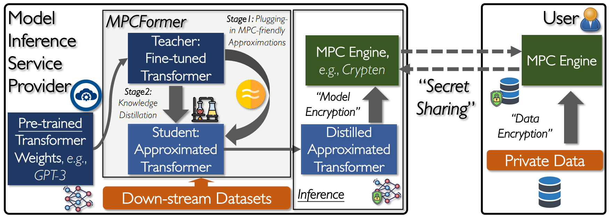
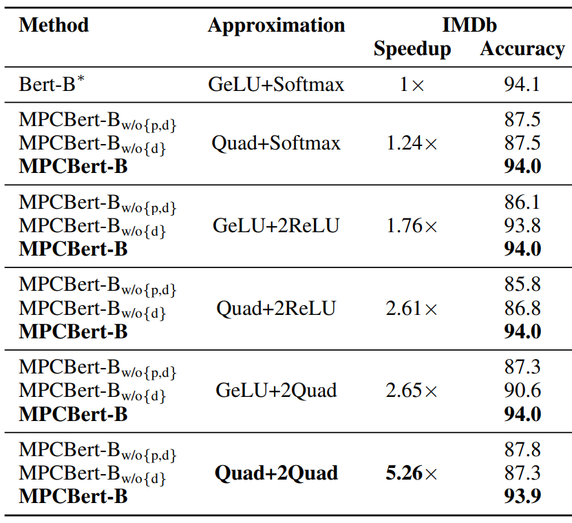
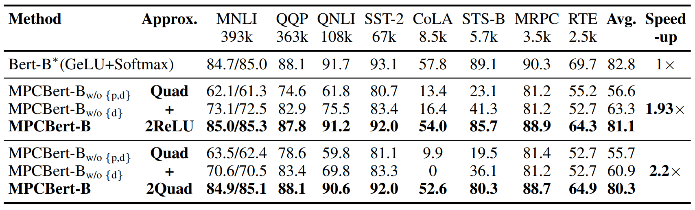

# MPCFormer: fast, performant, and private transformer inference with MPC.
[**Paper**](https://arxiv.org/pdf/2211.01452.pdf) | 
[**Usage**](#usage) |
[**Citation**](#citation) |
[**Video**](https://recorder-v3.slideslive.com/?share=81100&s=69c62c48-1730-4eb9-84ae-586fa4ff937d) |

This repository contains the official code for our ICLR 2023 spotlight paper MPCFormer: fast, performant, and private transformer inference with MPC.
We design MPCFormer to protect users' data privacy by using Secure Multiparty Computation(MPC). It also meets other real-world requirements:
- inference latency: by replacing bottleneck functions by their MPC-friendly ones.
- ML performance: by introducing a subsequent Knowledge-Distillation(KD) procedure.



## Performance 
It achieves 5.26x speedup for Bert-Base MPC inference, while preserving a similar ML accuracy. More comprehensive results such as on Bert-Large, Roberta, can be found in the paper.

 

## Usage
To install necessary packages, install the transformer directory in editor mode:
    
    git clone https://github.com/MccRee177/MPCFormer
    cd MPCFormer/transformers
    pip install -e .

#### Step 1: Obtain a teacher Transformer model by fine-tuning on downstream tasks [**Here**](src/baselines)
We support GLUE and Imdb, other datasets can be easily supported via the ransformers library.

#### Step 2: perform approximation and distillation of MPCFormer [**Here**](src/main).

#### (Optional) evaluate baselines in the paper [**Here**](src/baselines).

#### (Optional) Benchmark the inference time of approximated model: [**Here**](src/benchmark).


## Citation
If you find this repository useful, please cite our paper using
````
@article{li2022mpcformer,
  title={MPCFormer: fast, performant and private Transformer inference with MPC},
  author={Li, Dacheng and Shao, Rulin and Wang, Hongyi and Guo, Han and Xing, Eric P and Zhang, Hao},
  journal={arXiv preprint arXiv:2211.01452},
  year={2022}
}
````

 


